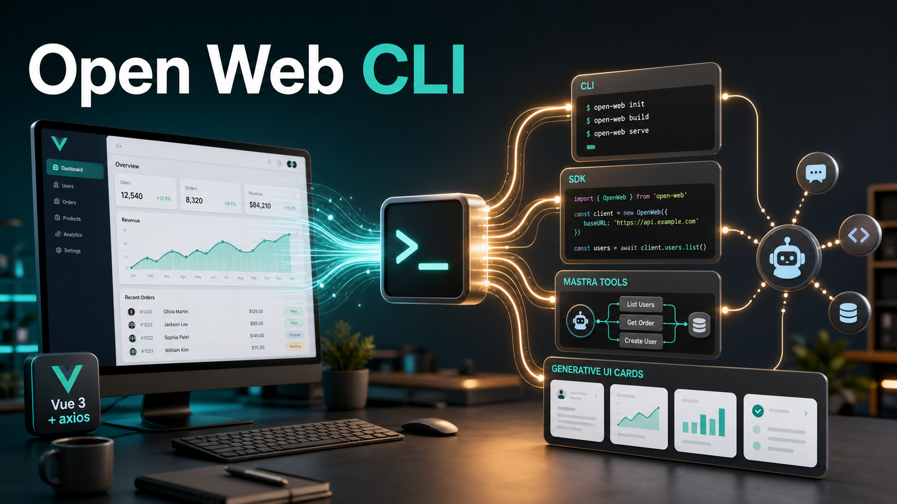

# Open Web CLI



Open Web CLI is a source-driven generator that turns an existing Vue 3 + axios web application into an agent-ready adapter package.

It is designed for teams that already have a working web product and want to expose selected business capabilities to agents without rebuilding the product from scratch. The generated adapter can provide a local CLI, TypeScript SDK, Mastra tools, and Vue generative UI cards from the same capability contract.

## What It Generates

Open Web CLI reads a target web project plus an `open-web.config.ts` file and emits an independent npm package:

```text
web-agent-adapter/
  src/
    cli.ts
    sdk.ts
    manifest.ts
    capabilities/
    cards/
    adapters/
      mastra.ts
      vue.ts
    runtime/
```

The generated package is intended to support:

```ts
import { createSdk } from '@company/web-agent-adapter';
import { createMastraTools } from '@company/web-agent-adapter/mastra';
import { cardRegistry } from '@company/web-agent-adapter/vue';
```

## Core Ideas

- **Source-driven conversion**: the primary input is a known Vue 3 + axios codebase, not an arbitrary website.
- **One capability contract**: CLI commands, SDK methods, and agent tools expose the same selected capabilities.
- **Axios atoms first**: the scanner discovers low-level API candidates, then release capabilities are explicitly allowlisted.
- **Agent-side UI decoupling**: CLI/SDK results can include a prepared UI payload, while the agent backend only passes it through.
- **Generated Vue registry**: UI cards ship with the adapter package and render from `component + props`.
- **Auth reuse**: browser login captures the original web login flow and persists normalized auth state through a pluggable store.

## Example Config

```ts
import { defineOpenWeb } from 'open-web-cli';

export default defineOpenWeb({
  output: {
    packageDir: '../demo-agent-adapter',
    packageName: '@demo/agent-adapter',
  },
  expose: {
    capabilities: {
      'user.list': {
        from: 'src/api/user.ts#listUsers',
        description: 'List users',
      },
    },
  },
  cards: {
    'user-list-card': {
      source: 'src/components/UserListCard.vue',
      capability: 'user.list',
    },
  },
});
```

## Install And Run

Install the generator in a Vue 3 + axios project, then run it from that project directory:

```bash
npm install -D open-web-cli
open-web inspect --json
open-web generate
open-web build
```

`open-web` defaults `--project` to the current working directory. Use `--project <path>` when running from another directory, and `--config <path>` when the config file is not named `open-web.config.ts`.

The demo app in `examples/demo-vue-axios` references this package locally while developing:

```bash
npm run build
cd examples/demo-vue-axios
npm install
npm run open-web:inspect
npm run open-web:build
```

To verify the published shape before releasing:

```bash
npm test
npm pack --dry-run
```

## Commands

```bash
open-web inspect
open-web generate
open-web build
```

Generated adapter CLIs are expected to expose:

```bash
web-agent login
web-agent auth status
web-agent logout
web-agent <resource> <action>
```

Capability commands output a stable JSON envelope by default so they can be used directly by agents and tool wrappers.

## Generative UI Result Shape

Capabilities can return data only, or data plus a frontend-ready UI payload:

```json
{
  "ok": true,
  "capability": "user.list",
  "data": [],
  "summary": "Found 0 users.",
  "ui": {
    "kind": "card",
    "component": "user-list-card",
    "props": {
      "users": []
    }
  }
}
```

With Mastra + AI SDK, the adapter appends one unified `data-open-web-ui` message part. The model receives `data` and `summary`; the frontend receives the full UI payload and renders it through the generated Vue registry.

## MVP Scope

The first milestone is tracked in [MVP: Vue3 axios web-to-agent adapter generator](https://github.com/EnochLi15/open-web-cli/issues/1).

MVP acceptance is based on a demo Vue 3 + axios app that proves the full vertical slice:

1. Inspect axios atoms and card candidates.
2. Generate an independent adapter package.
3. Capture browser login auth state.
4. Run a generated CLI capability command.
5. Import and call the generated SDK.
6. Expose Mastra tools.
7. Emit `data-open-web-ui`.
8. Render a generated Vue card registry.

See [CONTEXT.md](CONTEXT.md) and [docs/prd/mvp.md](docs/prd/mvp.md) for the current architecture and product decisions.
